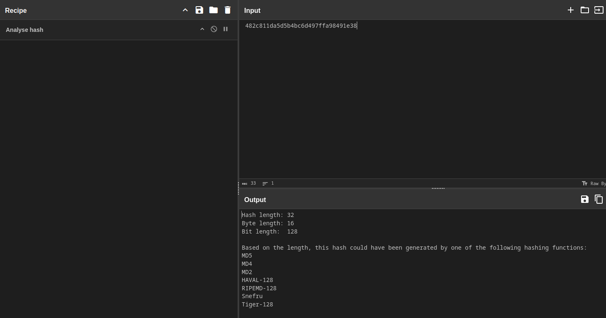

This challenge shows us a plethora of results of a hashing algorithm the challenge is being able to check which one is which algorithm, and while you can try to identify each one of them luckily cyberchef has an operation called the analyse hash, just put something in it with a hash, and then it will idetify the hashing algorithm for you, just like so:

After you have identifies them, you can just simply find some tool online that can find a way to find the plaintext of the hash, and then voila! you have all the passwords that you will need.