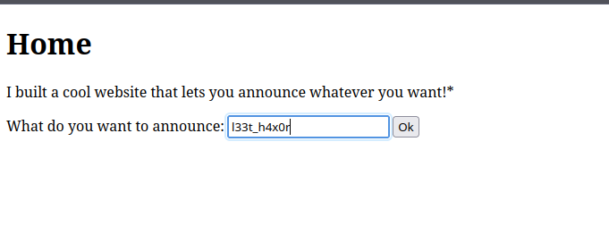

This one is an interesting challenge based on the concept of Serverside Template Injection (SSTI), basically what that means is we are going to use the native syntax of the template to do some funny stuff, in this case finding the flag through nefarious means.

This is the webpage, super bland, the base functionality is just to input something, and then it will be announced

First though we have to try and find what exactly powers this web app, and because im not really efficient, I had to find out the hard way through using burpsuite, so after checking the response to the request of sending my text to the server I was greeted with werkzeug, which through painful googling showed that the template engine is jinja2. 

So after this I basically scoured the internet for injections that I can use, to make sure that I was at the right path though, I tried this injection: {{ 2+ 2 }}, and lo and behold I got the result that I wanted.

So basically I just spent an embarassing amount of time trying to find an injection for this, when I realized that we were living the year 2025 AD, where ChatGPT exists, so I used it to try and find an injection and it came up with this: {{ ''.__class__.__mro__[1].__subclasses__()[INDEX].__init__.__globals__['__builtins__']['__import__']('os').popen('ls').read() }}. 

This script looks so confusing, but basically what it does is import the module OS, and then tries to use the subprocess popen to execute os commands, of course I used the command ls to find the files, and I was greeted with this:

After that everything was simple, just change the command to 'cat flag' so that we can read it, and finally I got the flag:

